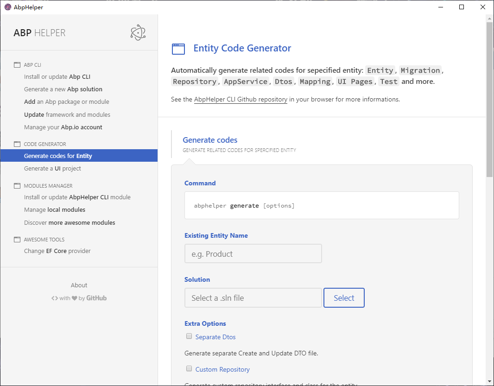
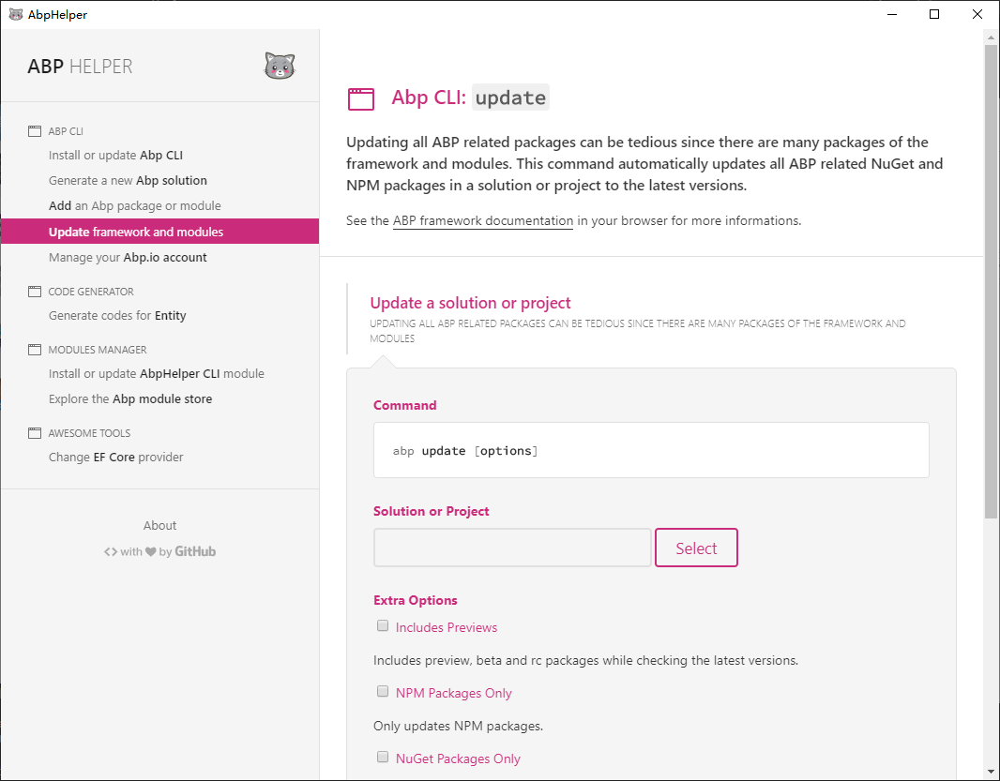

# AbpHelper.GUI

AbpHelper is a tool to help you with developing Abp vNext applications. AbpHelper GUI can be used to call ABP CLI, generate code, manage modules, etc.

# Getting Started

1. Download the [last release](https://github.com/EasyAbp/AbpHelper.GUI/releases).

1. Unpack the files and run the executable file.

1. Explore this wonderful application.

# Roadmap

- [ ] Support ABP CLI login command
- [x] AbpHelper CLI update check
- [ ] Solution management
- [ ] Abp module store
- [ ] EF Core provider change helper

We are always looking forward to your code contribution.